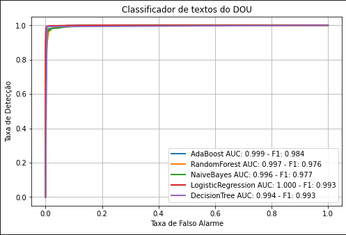

# Relatório de Modelagem

## Análise de Dados

Os dados com as informações das avaliações foram processados para a criação de novas features.
O processamento consiste em contar a quantidade de vezes que cada palavra é escrita nos comentários. Essa contagem é feita por avaliação.

Alguns processos de normalização foram utilizados, como o Tf-Idf (Term Frequency, Inverse Document Frequency). A contagem de cada palavra é normalizada pela quantidade de documentos que essa palavra aparece. Palavras que aparecem em todos as avaliações teriam um Idf alto, logo diminuindo o valor da feature para essa palavra. 
 

### Contagem de palavras

Foram observadas palavras com contagens superiores a 160.000. Pode-se ver que a distribuição da contagem de palavras segue uma distribuição exponecial.

A palavra mais comum é *art*. Além de ser mais comum, ela parece ter poder de classificação, uma vez que a sua contagem por classe é alta.

A seguinte nuvens de palavras para textos de interesse foi gerada e é um bom indicativo que uma simples contagem de palavras mais frequentes em novos textos a serem classificados pode ser sufiente para classificá-los.

Já termos como nome de meses, grande, gerais, e elétricas parecem ser mais frequentes em informações que não são de interesse.

### Normalização por TfIdf

Os resultados da normalização mostraram que a distribuição das features de cada palavra tem uma calda menos longa que o distribuição da contagem das palavras.

O valor médio das features normalizadas por TfIdf diferem quando calculado para os comentários de cada classe. Pode-se observar que algumas palavras que não eram frequentes, como *operação comercial* possuem uma diferença considerável no seu valor médio quando calculado para as classes.

Abaixo apresentamos o gráfico de proporção por classe de interesse para o tfidf médio.

## Modelagem

Após a análise preliminar, devemos seguimos com o treinamento dos modelos de classificação, utilizando validação cruzada como forma de estimar os hiper-parâmetros do modelo que conseguem a melhor generalização possível.

Foram utilizados os seguintes modelos 

* AdaBoost: [AdaBoostClassifier](https://scikit-learn.org/stable/modules/generated/sklearn.ensemble.AdaBoostClassifier.html)
* RandomForest: [RandomForestClassifier](https://scikit-learn.org/stable/modules/generated/sklearn.ensemble.RandomForestClassifier.html)
* NaiveBayes: [MultinomialNB](https://scikit-learn.org/stable/modules/generated/sklearn.naive_bayes.MultinomialNB.html)
* LogisticRegression: [LogisticRegression](https://scikit-learn.org/stable/modules/generated/sklearn.linear_model.LogisticRegression.html)
* DecisionTree: [DecisionTreeClassifier](https://scikit-learn.org/stable/modules/generated/sklearn.tree.DecisionTreeClassifier.html)

Os modelos foram treinados utilizando a técnica de grid search (exaustiva) e validação crizada com 5 separações (Fold). Desta forma espera-se a otimização da distribuição de dados de treino e teste de forma a evitar vícios no modelo. Além de obter o melhor resultado de 'fit'.

A curva ROC dos modelos foi a seguinte:

Podemos observar uma alta sensibilidade, acurácia e f1-score em todos dos modelos. Uma situação de classificação quase perfeita e praticamente qualquer um poderia ser o escolhido.  
Devemos sempre questionar esses resultados. A princípio com o uso da validação cruzada e o uso da técnica de grid search não deveríamos ter overfitting nos dados. Uma explicação para esta resposta pode ser algum tipo de polarização do modelo, de forma que somente algumas poucas palavras ou conjunto de palavras já definam a classificação.

Detalhe da curva ROC

O score do modelo DecisionTree

precision    recall  f1-score   support

       False       0.99      0.99      0.99      4730
        True       0.99      0.99      0.99      4080

    accuracy                           0.99      8810
   macro avg       0.99      0.99      0.99      8810
weighted avg       0.99      0.99      0.99      8810

### Matriz de Confusão

A matriz de confusão é geralmente utilizada para decrever a preformance da classificação do modelo num certo conjunto de dados em que os valores alvo #são conhecidos. Dela são retiradas algumas métricas como: Acurácia, Precisão, Sensibilidade e f1 score

E finalmente a função da distribuição de probalilidade, mostrando o alto grau de seletividade.

