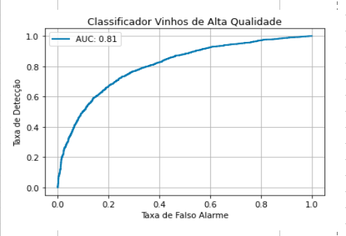
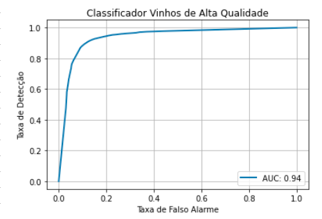
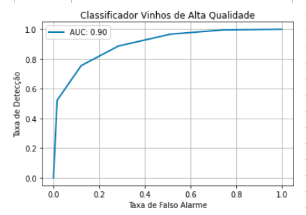

# Resultados 
## Modelos de Classificação Supervisionada - Case Vivino AI.

## Regressão Logística

#### Matriz de Confusão

| | Modelo - Baixa Qualidade| Modelo - Alta Qualidade| Modelo Total |
|-|-|-|-
|**Real - Baixa Qualidade**|1390|994|2384
|**Real - Alta Qualidade**|657|3456|4113
|**Real - Total**|2047|4450|6497

### Relatório de Classificação
| |Precision|Recall|f1-score|Qtd|
|-|-|-|-|-|
|Baixa Qualidade|0.68|0.58|0.63|2384
|Alta Qualidade|0.78|0.84|0.81|4113
|Accuracy|||0.75|6497
|Macro avg|0.73|0.71|0.72|6497
|Weighted avg|0.74|0.75|0.74|6497

## Árvore de Decisão

#### Matriz de Confusão

| | Modelo - Baixa Qualidade| Modelo - Alta Qualidade| Modelo Total |
|-|-|-|-
|**Real - Baixa Qualidade**|2060|324|2384
|**Real - Alta Qualidade**|337|3776|4113
|**Real - Total**|2397|4100|6497

### Relatório de Classificação
| |Precision|Recall|f1-score|Qtd|
|-|-|-|-|-|
|Baixa Qualidade|0.86|0.86|0.86|2384
|Alta Qualidade|0.92|0.92|0.92|4113
|Accuracy|||0.90|6497
|Macro avg|0.89|0.89|0.89|6497
|Weighted avg|0.90|0.90|0.90|6497

## kNN
#### Matriz de Confusão

| | Modelo - Baixa Qualidade| Modelo - Alta Qualidade| Modelo Total |
|-|-|-|-
|**Real - Baixa Qualidade**|1707|677|2384
|**Real - Alta Qualidade**|465|3648|4113
|**Real - Total**|2172|4325|6497

### Relatório de Classificação
| |Precision|Recall|f1-score|Qtd|
|-|-|-|-|-|
|Baixa Qualidade|0.79|0.72|0.75|2384
|Alta Qualidade|0.84|0.89|0.86|4113
|Accuracy|||0.82|6497
|Macro avg|0.81|0.80|0.81|6497
|Weighted avg|0.82|0.82|0.82|6497

## Conclusão

Pela métrica adotada informada no charter.md o modelo Árvore de Decisão foi o que apresentou o melhor resultado de classificação por apresentar os maiores f1-score.