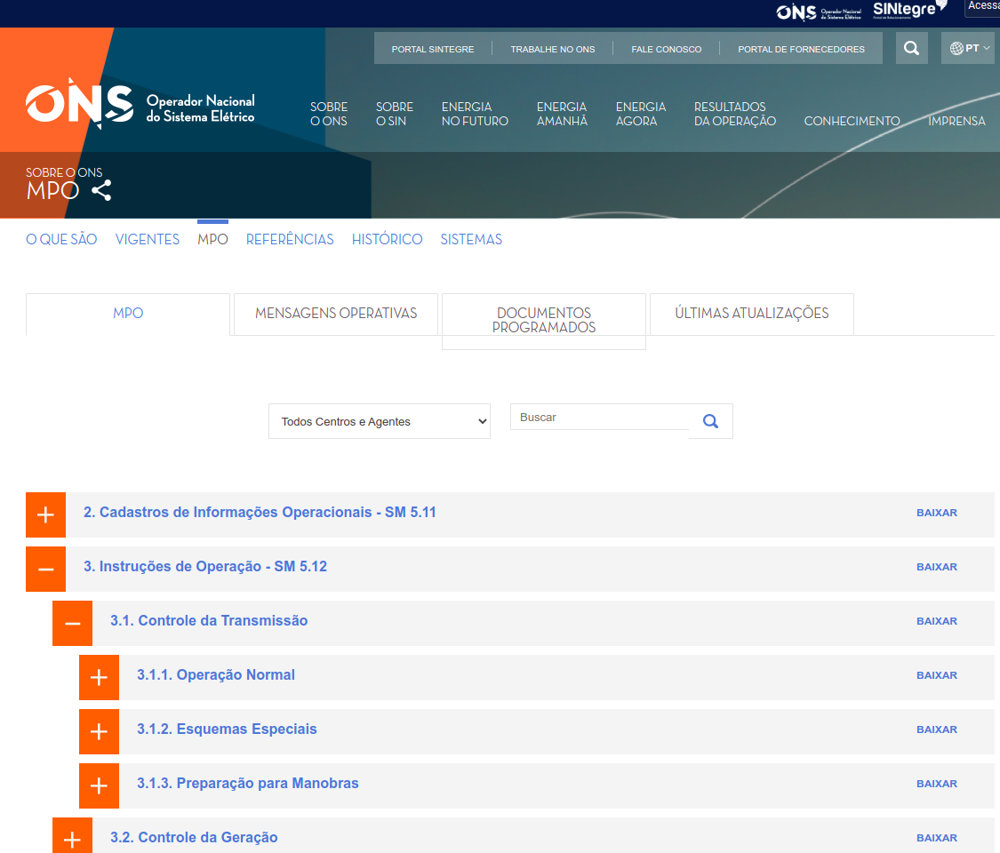
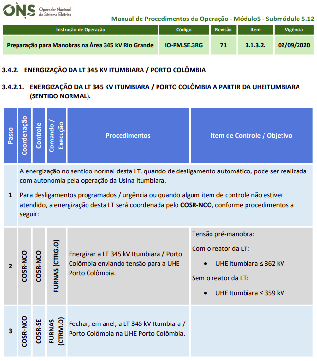
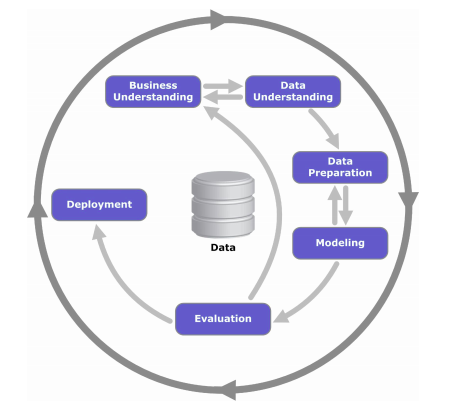
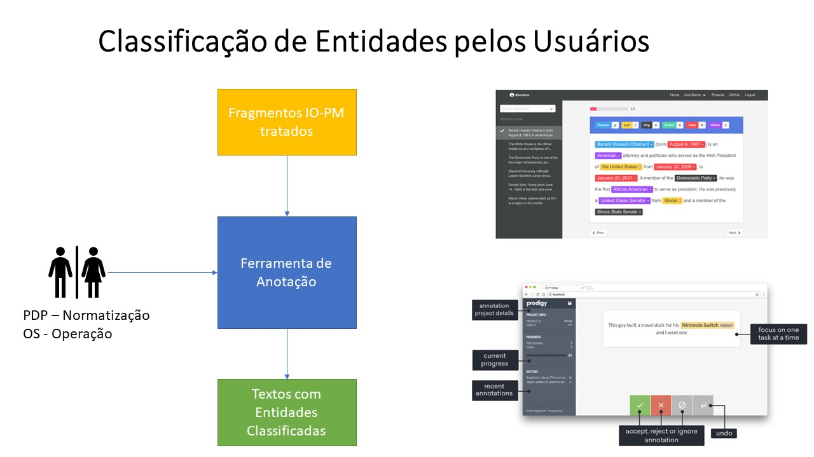
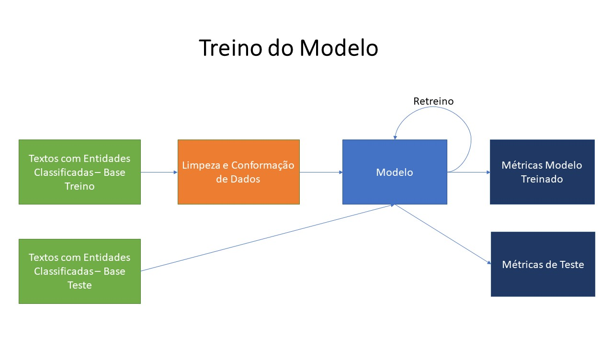
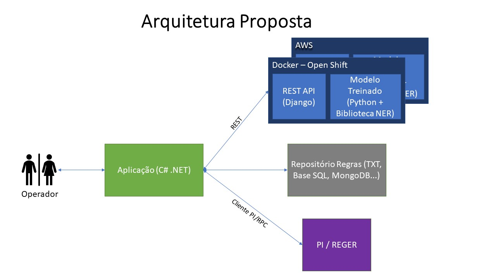

# IA para auxiliar os Operadores de Tempo Real do ONS em Procedimentos para a Manobra de Equipamentos

O objetivo do trabalho é identificar entidades de interesse nos Manuais de Programação da Operação (MPO) do Operador Nacional do Sistema Elétrico [ONS](http://www.ons.org.br/) e checá-las automaticamente no sistema de Tempo Real (STR). Mais especificamente nas chamadas Instruções Operativas de Preparação para Manobras (IO-PM). Estes documentos são públicos e podem ser encontrados em [Site ONS - MPO](http://www.ons.org.br/paginas/sobre-o-ons/procedimentos-de-rede/mpo)

Os Procedimentos para Manobra são utilizados por operadores, nos centros de operação do ONS em Brasília, Recife, Rio de Janeiro e Florianópolis, para recompor o Sistema Interligado Nacional (SIN) em caso de ocorrências de desligamentos de usinas, linhas de transmissão, transformadores e outros equipamentos importantes que possam causar interrupção de energia em regiões do Brasil. 

O processo atualmente é feito lendo um arquivo WORD/PDF que contém o passo a passo das ações que devem ser realizadas para a energização ou desenergização de um determinado equipamento. Alguns desses passos requerem que o Operador verifique informações no STR, como valores de tensão e corrente por exemplo, de forma que a ação seja condicionada. Ex.: Se o nível de tensão de uma linha de transmissão for maior que um determinado valor ela deve ser desligada, caso contrário deve ter seu nível de tensão reduzido.

### Exemplo de trecho de preparação para manobra na Área 345 kV Rio Grande

A ideia é criar um protótipo de forma a provar que após o reconhecimento das entidades um mapa de ações possa ser consultado, automatizando o máximo possível o processo de checagem de dados no STR. Ajudando assim o Operador a tomar decisões de forma mais rápida e segura, diminuindo o tempo de recomposição do SIN.

## Etapas de construção

Vamos utilizar o processo CRISP-DM para as etapas que envolvem o aprendizado de máquina

Desta forma teremos:

- Entendimento do problema. Introduzido neste documento
- Entendimento dos dados. Realização de Análise Exploratória dos Dados com as informações das IO-PM
- Preparação dos Dados. Limpeza, ex.: Retirada de tags HTML, Conformação: Retirada de palavras que não acrescentam na modelagem, etc.
- Modelagem. Uso de técnicas de aprendizado de máquinas: Classificação não supervisionada, NLP, Redes Neurais, etc.
- Avaliação. Uso de métricas para determinar a eficiências do modelo: Acurácia, Sensibilidade, Precisão, Especificidade, etc.
- Implantação. Industrialização do modelo treinado como serviço em ambiente com características de produção.

Para as etapas do mapa de regras e verificação de entidades do STR

- Criação de aplicação simples com: Entrada de texto de Procedimento de Manobra, repositório de regras, verificador de TAGs no PI/REGER e tela que mostra o resultado desta verificação.

## Processos de Construção

### Classificação

### Treino

### Arquitetura

# Demo

## 1 - Uso do SpaCy

Em Code/Model existe o notebook [DataModelingSpacy](../Code/Model/DataModelingSpacy.ipynb). Neste notebook exploramos as funcionalidades do framework SpaCy para o reconhecimento de entidades.

## 2 - Relatório de Dados

Em Docs/DataReport pode ser encontrado o relatório de dados do projeto [Relatório de dados](./DataReport/Report.md).

## 3 - Análise Exploratória de Dados

Em Code/Analysis existe o notebook [DataAnalysisExploration](../Code/Analysis/DataAnalysisExploration.ipynb). Neste notebook encontra-se a análise exploratória de dados responsável pelo melhor entendimento das informações do projeto.

## 4 - Preparação de Dados

Em Code/DataPrep existe o notebook [DataPreparation](../Code/DataPrep/DataPreparation.ipynb). Este notebook é reponsável pela preparação dos dados: higienização e conformidade, para que os dados possam ser utilizados pelos modelos de aprendizado de máquina.

## 5 - Modelagem

Em Code/Model existe o notebook [DataModeling](../Code/Model/DataModeling.ipynb). Neste notebook são aplicadas técnicas de aprendizado de máquina como clusterização por k-nearest neighbor (KNN) e Fatorização por Matriz não negativa (NMF) de forma a classificar e entender quais são as entidades mais importantes. 